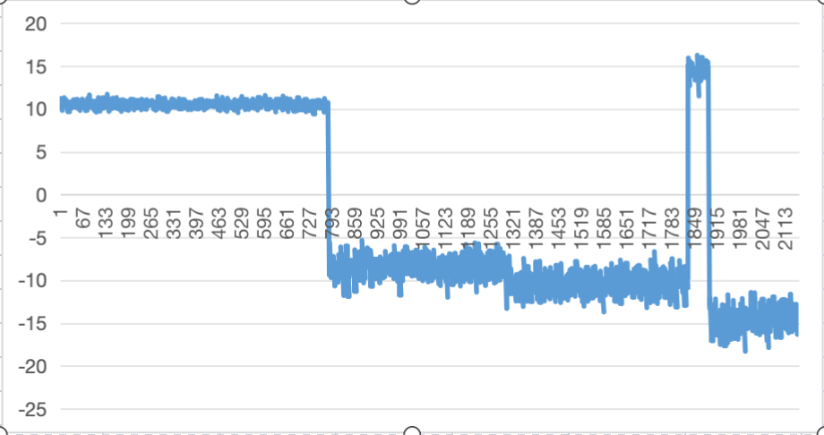

### Based on Genius Works: **Bayesian Online Changepoint Detection** 

####  ~But Real Online Data Pattern
yeah, no matrix created before the "unknown" data comes along
####  ~Slim Version with Slice
tedious history data removed and no interchange or other VecDense/Dense operation needed
####  ~Original Version with mat package
show my respect
####  ~Tested with the original data set
well, try [really hard] to earn trust

> https://arxiv.org/pdf/0710.3742v1
> https://gregorygundersen.com/blog/2019/08/13/bocd/
> https://github.com/hildensia/bayesian_changepoint_detection/tree/master

##### ~Everytime, the input and output would be different. sometimes changepoints may even merge!!!
Go Nuts!!!

_______

